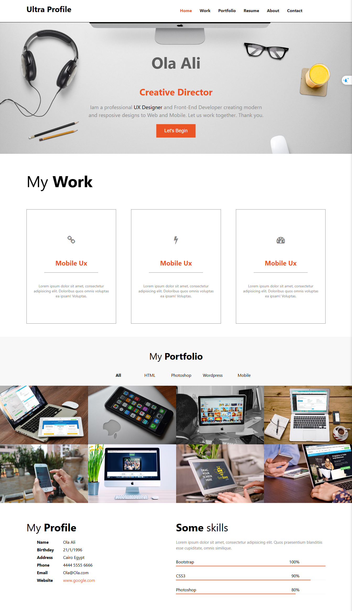
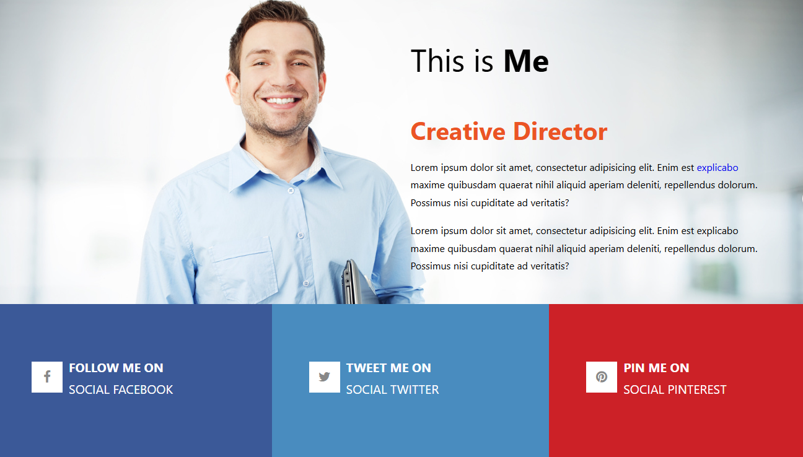

# Create-React-Template_class-components

This is a simple Template built with ReactJs [class-component] and Styled Component and react-router-dom . and it has lots of components like (About,Contact,Footer,Home,Index,Navbar,Portfolio,Profile,SocialMedia,Work)

## Table of contents

- [Overview](#overview)
- [Components](#Components)
  - [App](#App)
- [Installation](#Installation)
- [Usage](#Usage)
- [Links](#Links)
- [Screenshot](#Screenshot)
- [What I learned](#what-i-learned)
- [Continued development](#continued-development)
- [Author](#author)
- [Acknowledgments](#Acknowledgments)


## overview
This is a simple Template built with ReactJs [class-component] and Styled Component and react-router-dom. It serves as an excellent example for those looking to understand and implement React.js concepts in their projects.

## Components

it has lots of components like (About,Contact,Footer,Home,Index,Navbar,Portfolio,Profile,SocialMedia,Work)

### App

The main component that holds all subcomponents (About,Contact,Footer,Home,Index,Navbar,Portfolio,Profile,SocialMedia,Work) and how to route between them

every subcomponent has it's own style file and both are in a separate file


## Installation
To get started with this project, follow these steps:

you can clone the project or download it as Zip file.
1. Clone the repository:
   ```bash
   git clone https://github.com/olahasan/Create-React-Template_class-components

2. Navigate to the project directory:
   cd <project-directory>

3. Install the required dependencies:
   npm install   


## Usage
To run the application, use the following command:

npm start


## Links

If you want to open the link in a new tab, you can:

- Press **Ctrl** (or **Cmd** on Mac) while clicking the link.
- Right-click the link and select **Open link in new tab**.

Otherwise, all links will open in the same tab.


- Solution URL: [here](https://github.com/olahasan/Create-React-Template_class-components)

- Live Site URL: [here](https://create-react-template-class-component.netlify.app/)

 ## Screenshot
 




## what-i-learned
Through this project:
1-I learned  how to create react app and treat with calss component.
2-how to deal with "react-router-dom" library using (BrowserRouter , Route, Routes)
3-how to deploy it on netlify

## Continued Development
In the future, I plan to:
- learn reactJs Hooks and redux.
- learn how to deploy reactJs project use gh-pages .

### Author

GitHub - @olahasan

### Acknowledgments

I would like to thank the **[unique coderz academy](https://www.youtube.com/@UniqueCoderzAcademy)** for providing this challenge and to the community for their support.

